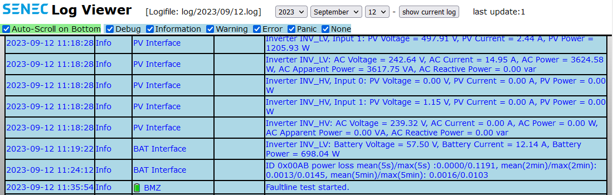

# Senec Log Viewer
downloading logfiles from Senec Machines and adapted "Senec Log Viewer" for lokal browsing logfiles

### Requirements
- Senec Machine with https://
- Local Webserver (Webserver must have access to the Senec Machine for log-downloading)

### how to use it
copy:
- images/*
- js/*
- senec_log.php
- senec_log.sh
- all_logs.sh

to your htdocs folder.

Edit senec_log.sh and all_logs.sh to your settings.
- chmod +x senec_log.sh
- chmod +x all_logs.sh

Start all-log-downloader one time:
- ./all_logs.sh

(it takes a while for downloading all your logfiles to htdocs/log)

Start log-file Updater with:
- ./senec_log.sh start

(it runs in the background and updated the current logfile)

open your browser http://your-domain-or-ip/senec_log.php
- you can change the Date for a specific logfile
- or click "show current log" to view the current log file, which is continuously updated with senec_log.sh

  
### Changelog
- 2024-04-18
  - Added color #b540d5 for External Control

- 2023-09-27
  - Added timeout for wget
  - Added more option for waittime

- 2023-09-19 Added more colors
  - Warning is now orange
  - Error is now red
  - NPU shows now in yellow
  - NET shows now in cyan

  
## Disclaimer
**All product and company names or logos are trademarks™ or registered® trademarks of their respective holders. Use of them does not imply any affiliation with or endorsement by them or any associated subsidiaries! This personal project is maintained in spare time and has no business goal.**

  
## :scroll: License ## 
 MIT License

Copyright (c)2023 by Daniel Gutgesell github@gutgesell.it

Permission is hereby granted, free of charge, to any person obtaining a copy
of this software and associated documentation files (the "Software"), to deal
in the Software without restriction, including without limitation the rights
to use, copy, modify, merge, publish, distribute, sublicense, and/or sell
copies of the Software, and to permit persons to whom the Software is
furnished to do so, subject to the following conditions:

The above copyright notice and this permission notice shall be included in all
copies or substantial portions of the Software.

THE SOFTWARE IS PROVIDED "AS IS", WITHOUT WARRANTY OF ANY KIND, EXPRESS OR
IMPLIED, INCLUDING BUT NOT LIMITED TO THE WARRANTIES OF MERCHANTABILITY,
FITNESS FOR A PARTICULAR PURPOSE AND NONINFRINGEMENT. IN NO EVENT SHALL THE
AUTHORS OR COPYRIGHT HOLDERS BE LIABLE FOR ANY CLAIM, DAMAGES OR OTHER
LIABILITY, WHETHER IN AN ACTION OF CONTRACT, TORT OR OTHERWISE, ARISING FROM,
OUT OF OR IN CONNECTION WITH THE SOFTWARE OR THE USE OR OTHER DEALINGS IN THE
SOFTWARE.
